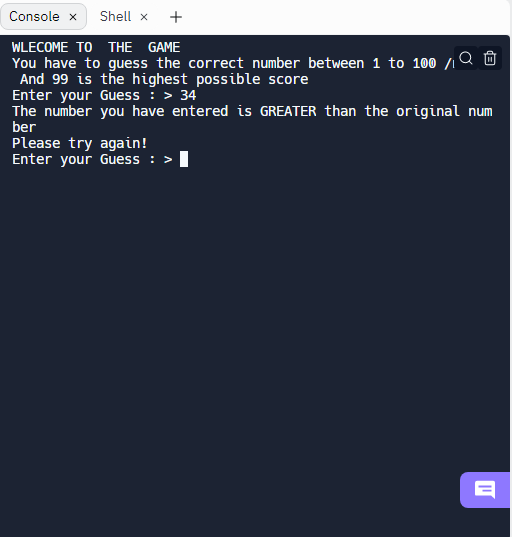

# Guess The Number Using JavaScript

This is a simple terminal based guess the number game where no ui is mandatory. Just the JS code. Do play and share your score.
## How to run the app

Just Clone The repo on your machine 

```bash
 and run the app.js file
```


## FAQ

#### Can I run this online ?

Definitely You can run it at  https://replit.com/@cleverhare/guess-the-number

#### Can I contribute ?

Yeah Definitely


## Authors

- [@cleverhare](https://www.github.com/cleverhare)


## Screenshots




## 🔗 Links
[](https://replit.com/@cleverhare/guess-the-number)

## Tribute 

Thanks for making this till the end. Your support is always appreciated. Generate a Pull Request with your supporting code. 
